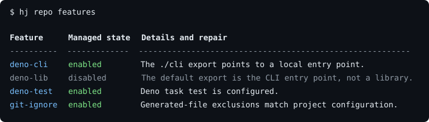

# hj

[](https://www.asd-ste100.org/)

`hj` configures repositories and automates personal development workflows. Run
it with Node.js, Bun, or Deno in the repository you want to manage.

| Area          | What `hj` manages                                          |
| ------------- | ---------------------------------------------------------- |
| Projects      | Git repositories and Deno project files.                   |
| Documentation | README files and licenses.                                 |
| GitHub        | Repository settings, protection rules, and workflows.      |
| Releases      | Version changes, changelogs, tags, and package publishing. |

<!-- hj:readme jsr-package:badges 572aba0516320896bc967eb6a2ab6257682c791937319c42ee30c162ca6165bd -->

[](https://jsr.io/@hugojosefson/cli)
[](https://jsr.io/@hugojosefson/cli)

<!-- /hj:readme -->

<!-- hj:readme github-release-publish-npm:badge c9cf2e0e859be880fd5a386c1654e2aa24b3764dd827580bd4ad4ac07b5dc1cf -->

[](https://www.npmjs.com/package/@hugojosefson/cli)

<!-- /hj:readme -->

<!-- hj:readme github-ci:badge cef2c14f63758c9d69d92ef24b123236225fdf1984e0a9e31519646de6464d00 -->

[](https://github.com/hugojosefson/cli/actions/workflows/hj-ci.yaml)

<!-- /hj:readme -->

## Prerequisites

Use Linux x64 with glibc.

Choose one of the supported runtimes:

- Node.js 24 or 26.
- Bun 1.4.2.
- Deno 2.9.6.

## Install

### Node.js

Inspect the current directory without a global install:

```bash
npx @hugojosefson/cli repo features
```

Or install the `hj` command globally:

```bash
npm install --global @hugojosefson/cli@latest
```

Run this command again to upgrade to the latest release.

### Bun

Inspect the current directory without a global install:

```bash
bunx --bun --package @hugojosefson/cli hj repo features
```

### Deno

Install `hj` from [JSR](https://jsr.io/@hugojosefson/cli):

```bash
deno install --global --allow-all --reload --force --name hj jsr:@hugojosefson/cli
```

Run this command again to upgrade to the latest release.

If needed, add the binary directory printed by Deno to your `PATH`. The command
grants full Deno permissions so `hj` can manage files and run external tools.

Deno delays new dependencies for 24 hours by default. To install a release
immediately, add `--min-dep-age=0` to the command. This skips the delay for that
installation. See the
[Deno installation reference](https://docs.deno.com/runtime/reference/cli/install/)
for more options.

## Start here

Change to the directory you want to manage. Inspect its features:

```bash
hj repo features
```

This command reports the current state without changes. Here are selected rows
from this repository:

<!-- Generated by deno task readme-example. Do not edit. -->




Choose changes interactively:

```bash
hj repo features --interactive
```

Use built-in presets to select a group of features with one flag:

| Option                | What it selects                                                     |
| --------------------- | ------------------------------------------------------------------- |
| `--defaults`          | [Configured defaults](docs/configuration.md), or Git and README. |
| `--github`            | Common GitHub repository settings, including private visibility.    |
| `--github-protection` | Default-branch protection and protected tags.                       |
| `--github-public`     | Public visibility, including when combined with `--github`.         |

Apply the default feature selection:

```bash
hj repo features --defaults
```

Apply common GitHub settings with public visibility, or add branch and tag
protection:

```bash
hj repo features --github --github-public --yes
hj repo features --github-protection --yes
```

Explicit feature flags override presets regardless of argument order. For
example, apply the GitHub preset but disable its issues feature:

```bash
hj repo features --github --no-github-issues --yes
```

For command help, run:

```bash
hj --help
hj repo features --help
```

Feature operations apply to the current directory. The
[feature guide](docs/repository-features.md) explains selection and
confirmation.

## Remove

| Installation | Command                                    |
| ------------ | ------------------------------------------ |
| npm          | `npm uninstall --global @hugojosefson/cli` |
| Deno         | `deno uninstall --global hj`               |

## Documentation

### Using hj

| Guide                                                 | Topic                                         |
| ----------------------------------------------------- | --------------------------------------------- |
| [Repository features](docs/repository-features.md) | Select, enable, disable, and repair features. |
| [Configuration](docs/configuration.md)             | Set default features and command options.     |
| [Changelog](./CHANGELOG.md)                          | Read release notes and known limits.          |

### Project automation

| Guide                                                 | Topic                                                         |
| ----------------------------------------------------- | ------------------------------------------------------------- |
| [Releases](docs/releases.md)                       | Configure release workflows and recover interrupted releases. |
| [Local Deno selection](docs/local-deno-runtime.md) | Choose Deno for project tasks and reuse its cache.            |

### Development and project status

| Guide                                                                | Topic                                                     |
| -------------------------------------------------------------------- | --------------------------------------------------------- |
| [Development](docs/development.md)                                | Run from source, install locally, test, and contribute.   |
| [Runtime tests](docs/development.md#local-commands)               | Run the same suite in Deno, Node.js, and Bun.             |
| [Live validation](docs/live-validation.md)                        | Read release and runtime validation results.              |
| [Issues](https://github.com/hugojosefson/cli/issues)                 | Track proposed changes, validation, and design decisions. |
| [Project](https://github.com/users/hugojosefson/projects/10/views/2) | Browse work, ideas, priorities, and recorded decisions.   |

## License

[MIT](./LICENSE)
